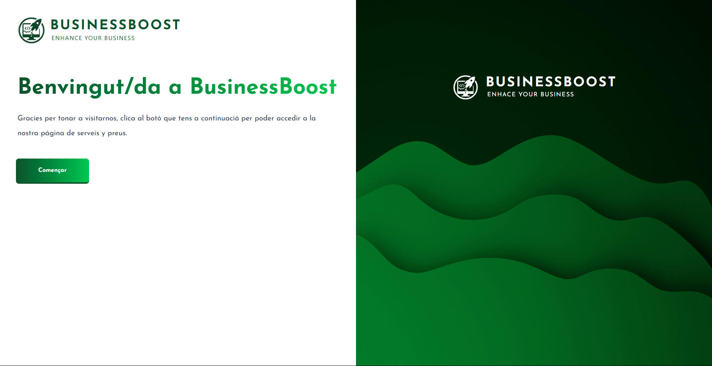
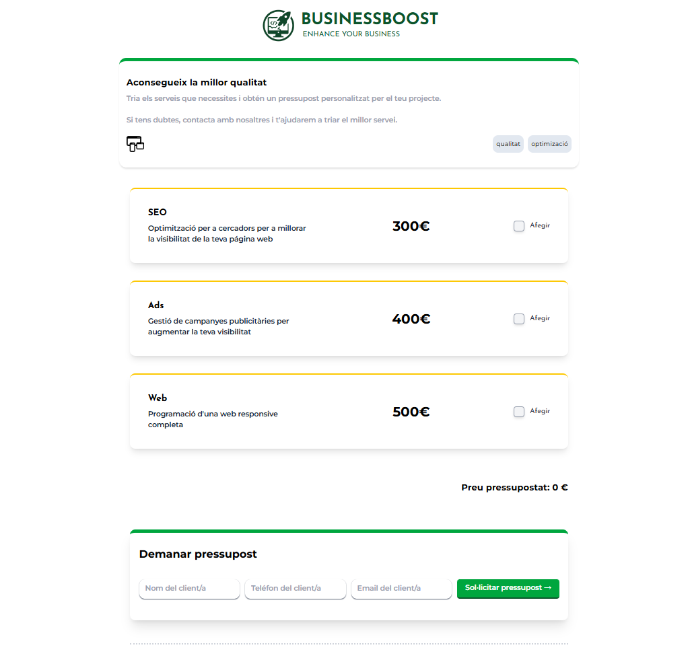

# 💰 Sprint 6 - Budget Website


## 🧠 Goals

- Put into practice React concepts as components, hooks and props.
- Good use of React Router.
- Using typescript correctly.
- Structure the project well

## 📝 Key Tasks for the project

- Develop an application with the aim of speeding up calculations for a website's budget,
- The website will have to respond and adjust the total price based on the options selected by the user.
- Make a responsive and improved design.

## 🎥 Preview

### 💸 Budget Website app View


---

### 🏠 Welcome Page


---

### 🧮 CalculatorPage


---

## 🛠️ Getting Started

### 1️⃣ Clone this repository

```bash
https://github.com/JlBestMc/S6.-Budget-Website.git

```

### 2️⃣ Install Dependencies

Make sure you have Node.js installed. Then install the packages:

```bash
npm install
```

### 3️⃣ Start Development Server

```bash
npm run server
```


## 📁 Project Structure

```
📦 Budget-Website
┣ 📂 public
┣ 📂 preview
┣ 📂 src/
      ┣ 📂 assets  
      ┣ 📂 Features
         ┣ 📂 BudgetForm
            ┣ 📂 Components
                ┣ 📄 BudgetForm.tsx
                ┣ 📄 BudgetList.tsx
                ┗ 📄 SortButtons.tsx
            ┗ 📂 Types
                ┗ 📄 budgetTypes.ts
         ┣ 📂 Cards
            ┣ 📂 Components
                ┣ 📄 Card.tsx
                ┣ 📄 Checkbox.tsx
                ┣ 📄 CardList.tsx
                ┗ 📄 WebOptions.tsx
            ┣ 📂 data
                ┣ 📄 services.ts
            ┣ 📂 hooks
                ┣ 📄 useSelestableServices.ts
            ┣ 📂 lib
                ┣ 📄 calculateTotal.ts
            ┗ 📂 Types
                ┗ 📄 servicesTypes.ts  
         ┗ 📂 InfoModal
            ┗ 📄 InfoModal.tsx
      ┣ 📂 pages
         ┣ 📄 CalculatorPage.tsx
         ┗ 📄 WelcomePage.tsx
      ┣ 📄 app.tsx
      ┣ 📄 main.tsx
      ┗ 📄 styles.css
┗ 📄 index.html

```

## 🛠 Technologies Used

    - TypeScript
    - React
    - HTML
    - CSS (Tailwind)


## ⏳ Project Status


